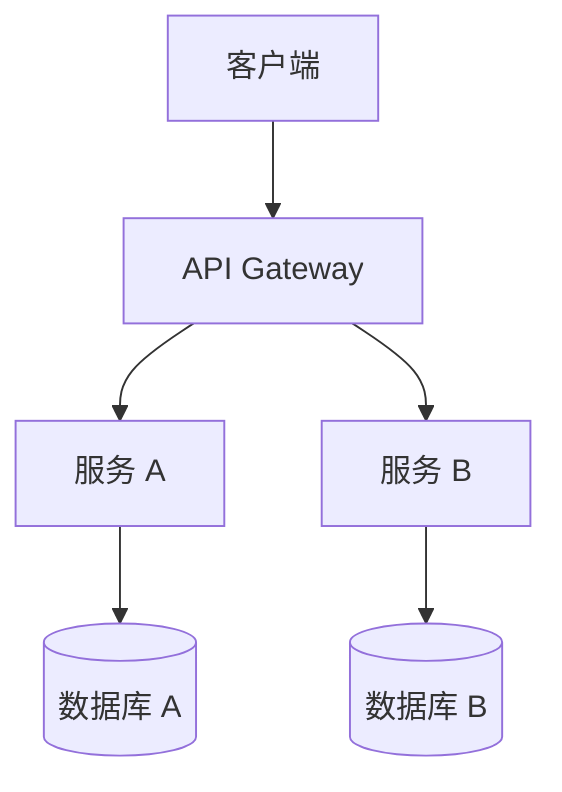
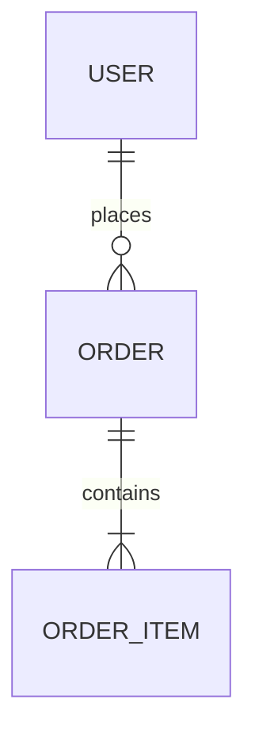

# 技术架构文档模板

## 文档信息

| 项目 | 内容 |
|------|------|
| 产品名称 | |
| 文档版本 | v1.0 |
| 创建日期 | YYYY-MM-DD |
| 架构师 | |

---

## 1. 架构概述

### 1.1 设计原则
- [原则 1：如高可用、高扩展]
- [原则 2]

### 1.2 架构风格
[如：微服务、单体、Serverless]

---

## 2. 技术选型

### 2.1 前端技术栈
| 类别 | 技术 | 版本 | 理由 |
|------|------|------|------|
| 框架 | | | |
| 语言 | | | |

### 2.2 后端技术栈
| 类别 | 技术 | 版本 | 理由 |
|------|------|------|------|
| 语言 | | | |
| 框架 | | | |
| 数据库 | | | |

### 2.3 基础设施
| 类别 | 服务/产品 | 理由 |
|------|-----------|------|
| 云服务 | | |
| CDN | | |

---

## 3. 系统架构

### 3.1 整体架构图



### 3.2 模块划分
| 模块 | 职责 | 技术 |
|------|------|------|
| | | |

---

## 4. 数据架构

### 4.1 ER 图



### 4.2 核心表结构

#### users
| 字段 | 类型 | 说明 |
|------|------|------|
| id | bigint | 主键 |
| username | varchar | 用户名 |

---

## 5. API 设计

### 5.1 接口规范
- 协议：HTTP/HTTPS
- 格式：JSON
- 认证：JWT

### 5.2 核心接口

#### POST /api/v1/resource
**请求**:
```json
{
  "field": "value"
}
```

**响应**:
```json
{
  "code": 200,
  "data": {}
}
```

---

## 6. 部署架构

### 6.1 环境规划
| 环境 | 用途 | 配置 |
|------|------|------|
| dev | 开发 | |
| staging | 预发布 | |
| prod | 生产 | |

### 6.2 扩展策略
- 水平扩展：[方案]
- 缓存策略：[方案]

---

## 7. 安全设计

### 7.1 认证授权
[认证流程说明]

### 7.2 数据安全
[加密方案]

---

## 8. 监控方案

### 8.1 指标监控
| 指标 | 告警阈值 |
|------|----------|
| | |

### 8.2 日志收集
[日志方案]
